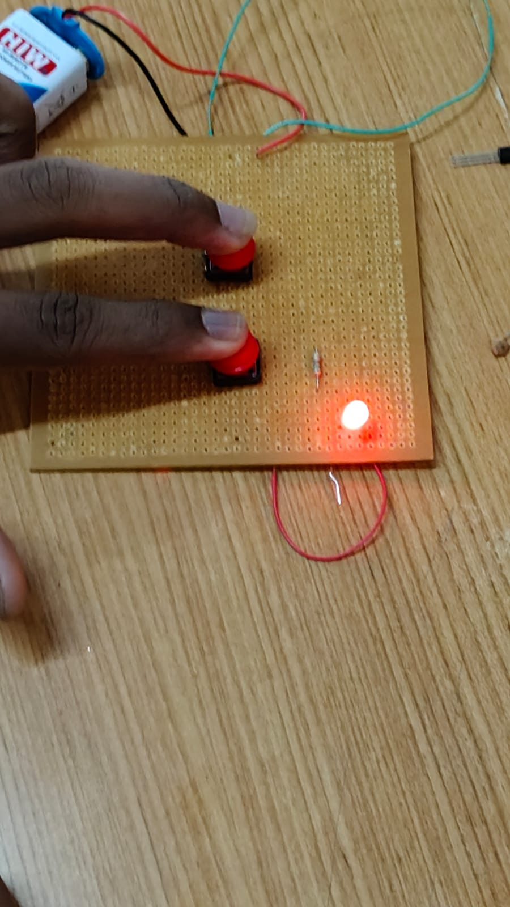

# **AND Logic Gate Simulation Circuit**

## Aim

To design and construct a circuit using two push-button switches, a resistor, and an LED that demonstrates the working of a two-input AND logic gate, such that the LED glows only when both push buttons are pressed simultaneously.

# Components Required

1. 9V Battery  
2. &nbsp;Battery Connector Clip&nbsp;  
3. Push Button Switches  
4. &nbsp;LED 2 4-pin tactile push button&nbsp;  
5. Resistor  
6. &nbsp;Perforated (Dot) Board 1 5mm,  
7. Red 220 ohm \- 1k ohm (current limiting)&nbsp;  
8. Connecting Wires

# Procedure

1. Take a perforated (dot) board and place the two push-button switches on it, spaced apart for easy access.&nbsp;  
2. Connect the battery's positive (+) terminal to one terminal of push button S1 using a connecting wire.  
3. &nbsp;Connect the other terminal of S1 to one terminal of push button S2, wiring the two switches in series.  
4. &nbsp;Connect the other terminal of S2 in series with the 220 ohm resistor.&nbsp;  
5. Connect the free end of the resistor to the anode (longer leg, \+) of the LED.&nbsp;  
6. Connect the cathode (shorter leg, \-) of the LED back to the battery's negative (-) terminal, completing the circuit loop.  
7. &nbsp;Double-check all connections on the board and ensure there are no loose or shorted wires  
8. &nbsp;Connect the battery, and test the circuit by pressing the push buttons in different combinations.

&nbsp;

# Working

An AND gate produces a HIGH (1) output only when all of its inputs are HIGH (1). In this circuit, each push button acts as one input to the gate. Since the two switches are connected in series between the battery and the LED, current can flow through the circuit and light the LED only when both switches are closed (pressed) at the same time, completing the path from the battery'spositive terminal, through S1, through S2, through the resistor and LED, and back to the negative terminal. If either switch, or both, are left open (not pressed), the current path is broken at that switch and the LED stays off. This behaviour exactly reproduces the truth table of a two-input AND gate, where the LED represents the logic output Y \= A . B.

&nbsp;

&nbsp;

## Observation

&nbsp;On testing the assembled circuit, it was observed that the LED remained OFF as long as at least one push button was not pressed. The LED lit up (glowed red) only in the case where both push buttons were pressed together, confirming that the circuit correctly behaves as a two-input AND gate. ![][image1]

